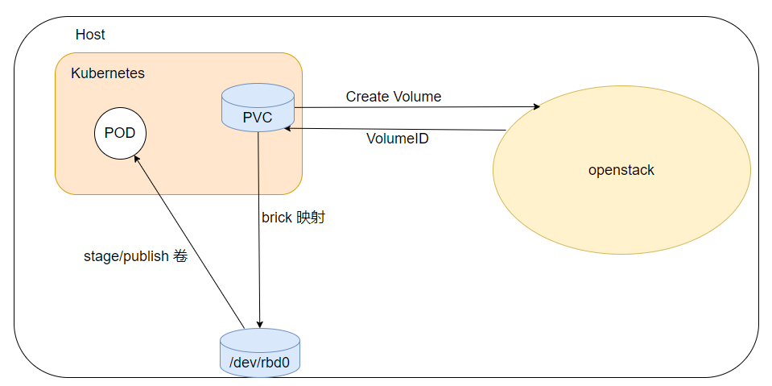

# cinder-metal-csi

The Cinder CSI Driver is a CSI Specification compliant driver used by Container Orchestrators to manage the lifecycle of OpenStack Cinder Volumes.

## Overview

The Cinder Metal CSI driver let openstack create cinder volume, map to the host, become the host a block device, and mount the block device
to the pod.



## Driver Deployment

You can either use the manifests under manifests file to deploy the cinder metal csi driver.

### Command-line arguments

cinder-metal-csi accepts the following command-line arguments:

- --nodeid <nodeid>
    - The kubernetes node IP.
- --endpoint <endpoint>
    - The endpoint of the gRPC server agents will use to connect to this CSI plugin, typically a local unix socket.
    - The manifests default this to unix:///csi/csi.sock, which is supplied via the CSI_ENDPOINT environment variable.
- --cloud-config <config file>
    - The path to a driver config file. The format of this file is specified in Driver Config.
    - The manifests default this to /etc/config/cloud.conf, which is supplied via the CLOUD_CONFIG environment variable.

## Driver Config

For Driver configuration, parameters must be passed via configuration file specified in `$CLOUD_CONFIG` environment variable.
The following sections are supported in configuration file.

### Global

- username Keystone username. If you are using Keystone application credential, this option is not required.
- password Keystone user password. If you are using Keystone application credential, this option is not required.
- user-domain-name Keystone user domain name.
- project-domain-name Keystone project domain name.
- tenant-name Keystone project name.
- auth-url Keystone service URL.
- region Keystone region name.
- endpoint-type Specify which type of endpoint to use from the service catalog. If not set, public endpoints are used.

### BlockStorage

- auth-strategy Auth strategy. Support keystone and noauth mode.
- cinder-listen-addr Noauth mode config the cinder service listen addr.
- node-volume-attach-limit To configure maximum volumes that can be attached to the node. Its default value is 256
- lvm-volume-type The lvm volume type name, default lvm. Consistent with the type parameters in the dynamic storage class.
- ceph-volume-type  The ceph volume type name, default rbd. Consistent with the type parameters in the dynamic storage class.
- local-volume-type  The local volume type name, default local. Consistent with the type parameters in the dynamic storage class.

### Use the manifests

All the manifests required for the deployment of the plugin are found at ```manifests/```

Configuration file specified in `$CLOUD_CONFIG` is passed to cinder CSI driver via kubernetes `secret`.

To create a secret:

* Encode your `$ClOUD_CONFIG` file content using base64.

`$ base64 -w 0 $CLOUD_CONFIG`

* Update ```cloud.conf``` configuration in ```manifests/csi-secret-cinderplugin.yaml``` file by using the result of the above command.

* Create the secret.

``` $ kubectl create -f manifests/csi-secret-cinderplugin.yaml```

* If the cinder backend storage type is ceph, you need to config ceph config file and ceph keyring file.

* Encode your `$CEPH_CONFIG` file content using base64.

  `$ base64 -w 0 $CEPH_CONFIG`

* Update ```ceph.conf``` configuration in ```manifests/cinder-config.yaml``` file by using the result of the above command.
* Create the configmap.

  ``` $ kubectl create -f manifests/cinder-config.yaml```

* Encode your `$CEPH_ADMIN_KEYRING` file content using base64.

  `$ base64 -w 0 $CEPH_ADMIN_KEYRING`

* Update ```key``` configuration in ```manifests/cinder-volume-rbd-keyring.yaml``` file by using the result of the above command.
* Create the Secrets.

  ``` $ kubectl create -f manifests/cinder-volume-rbd-keyring.yaml```

Once the secret is created, Controller Plugin and Node Plugins can be deployed using respective manifests.

```$ kubectl -f manifests/ apply```

This creates a set of cluster roles, cluster role bindings, and statefulsets etc to communicate with openstack(cinder).
For detailed list of created objects, explore the yaml files in the directory.
You should make sure following similar pods are ready before proceed:

```
$ kubectl get pods -n kube-system
NAME                                                  READY   STATUS    RESTARTS         AGE
cinder-metal-csi-controller-plugin-7ff586b8f5-fvb88   6/6     Running   0                2d22h
cinder-metal-csi-nodeplugin-58mwv                     4/4     Running   0                2d22h
```

To get information about CSI Drivers running in a cluster

```
kubectl get csidrivers.storage.k8s.io
NAME                            ATTACHREQUIRED   PODINFOONMOUNT   STORAGECAPACITY   TOKENREQUESTS   REQUIRESREPUBLISH   MODES        AGE
cinder.metal.csi                true             true             false             <unset>         false               Persistent   2d22h
```

## Cinder CSI Driver Usage Examples

### Dynamic Volume Provisioning

For dynamic provisoning , create StorageClass, PersistentVolumeClaim and pod to consume it.
Checkout [rbd volume](https://github.com/kungze/cinder-metal-csi/blob/manifests/example/nginx-rbd.yaml) definition fore reference.

Notes: Add the type parameter to create the storage class.

```shell
kubectl apply -f example/nginx-rbd.yaml
```

View the PVC status, Check the pvc is in Bound state which claims one volume from cinder

```
$ kubectl get pvc
NAME                            STATUS   VOLUME                                     CAPACITY   ACCESS MODES   STORAGECLASS           AGE
cinder-pvc-rbd                  Bound    pvc-444feb52-3e38-4a7f-962f-0f23de10b7a9   2Gi        RWO            cinder-metal-csi-rbd   3s

$ cinder list
+--------------------------------------+-----------+------------------------------------------+------+-------------+----------+-------------+
| ID                                   | Status    | Name                                     | Size | Volume Type | Bootable | Attached to |
+--------------------------------------+-----------+------------------------------------------+------+-------------+----------+-------------+
| fcb80e1b-5525-4bea-a552-443f73a97ca1 | in-use    | pvc-444feb52-3e38-4a7f-962f-0f23de10b7a9 | 2    | rbd         | false    | None        |
+--------------------------------------+-----------+------------------------------------------+------+-------------+----------+-------------+

```

To Check the volume created and attached to the pod

```
$ ls /dev/rbd2
/dev/rbd2

$ mount |grep rbd2
/dev/rbd2 on /var/lib/kubelet/plugins/kubernetes.io/csi/pv/pvc-444feb52-3e38-4a7f-962f-0f23de10b7a9/globalmount type ext4 (rw,relatime,stripe=16)
/dev/rbd2 on /var/lib/kubelet/pods/4a9dae22-2e0f-4813-aaea-4376d934d3c7/volumes/kubernetes.io~csi/pvc-444feb52-3e38-4a7f-962f-0f23de10b7a9/mount type ext4 (rw,relatime,stripe=16)
```

Then try to add a file in the pod's mounted position (in our case, /var/lib/www/html)

```shell
$ kubectl exec -it nginx-rbd bash
kubectl exec [POD] [COMMAND] is DEPRECATED and will be removed in a future version. Use kubectl exec [POD] -- [COMMAND] instead.
root@nginx-rbd:/# df -Th
Filesystem     Type     Size  Used Avail Use% Mounted on
overlay        overlay  549G   29G  499G   6% /
tmpfs          tmpfs     64M     0   64M   0% /dev
tmpfs          tmpfs    252G     0  252G   0% /sys/fs/cgroup
/dev/sdx1      ext4     549G   29G  499G   6% /etc/hosts
shm            tmpfs     64M     0   64M   0% /dev/shm
/dev/rbd2      ext4     2.0G   24K  1.9G   1% /var/lib/www/html
tmpfs          tmpfs    504G   12K  504G   1% /run/secrets/kubernetes.io/serviceaccount
tmpfs          tmpfs    252G     0  252G   0% /proc/acpi
tmpfs          tmpfs    252G     0  252G   0% /proc/scsi
tmpfs          tmpfs    252G     0  252G   0% /sys/firmware

root@nginx-rbd:/# touch /var/lib/www/html/index.html
root@nginx-rbd:/# exit
```

Next, make sure the pod is deleted so that the persistent volume will be freed

```shell
$ kubectl delete pod nginx-rbd

$ cinder list
+--------------------------------------+-----------+------------------------------------------+------+-------------+----------+-------------+
| ID                                   | Status    | Name                                     | Size | Volume Type | Bootable | Attached to |
+--------------------------------------+-----------+------------------------------------------+------+-------------+----------+-------------+
| fcb80e1b-5525-4bea-a552-443f73a97ca1 | available | pvc-444feb52-3e38-4a7f-962f-0f23de10b7a9 | 2    | rbd         | false    |             |
+--------------------------------------+-----------+------------------------------------------+------+-------------+----------+-------------+

```

