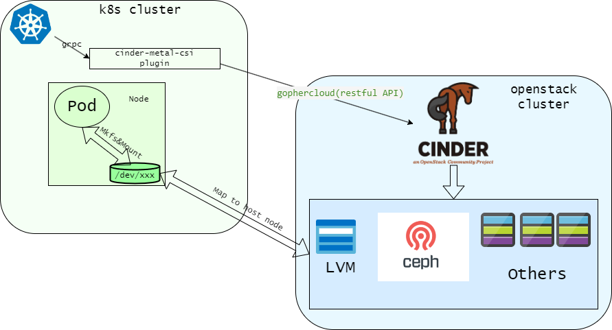

# cinder-metal-csi

Provision multiple storage backends by one CSI plugin for kubernetes cluster.

## Overview

The main difference with [cinder-csi-plugin](https://github.com/kubernetes/cloud-provider-openstack/blob/master/docs/cinder-csi-plugin/using-cinder-csi-plugin.md) is that
`cinder-metal-csi` just depend on cinder, don't need other openstack services.

### Features

* Support two auth strategies: keystone or noauth. If you have a full openstack
  cluster (Include keystone), the cinder's auth strategy is `keystone`, the cinder
  API service will verify the API caller. In this case, we need create a user for `cinder-metal-csi` plugin
  and add suitable role to the user in keystone. Another case: we don't want run other openstack services,
  they are useless for current environment. In this case, we can just deploy cinder service, and configure cinder's auth
  strategy as `noauth`, `cinder-metal-csi` just need to know cinder API's url.

* Support multiple storage backends, we aim to support all cinder's backend types. For now, we
  already support three type backends: `ceph rbd`, `LVM ISCSI` and `LVM Local`.

### Architecture



## Deployment

### Preparations

We need to prepare a k8s cluster and a openstack cluster (The openstack cluster can just run cinder service).

If the cinder's auth strategy is `keystone`, we also need to create keystone project and user for `cinder-metal-csi`:

```console
# openstack project create kubernetes
+-------------+----------------------------------+
| Field       | Value                            |
+-------------+----------------------------------+
| description |                                  |
| domain_id   | default                          |
| enabled     | True                             |
| id          | d74063d003c94ed7aa891434d1527ee6 |
| is_domain   | False                            |
| name        | kubernetes                       |
| options     | {}                               |
| parent_id   | default                          |
| tags        | []                               |
+-------------+----------------------------------+
# openstack user create --project kubernetes --password ChangeMe kubernetes
+---------------------+----------------------------------+
| Field               | Value                            |
+---------------------+----------------------------------+
| default_project_id  | d74063d003c94ed7aa891434d1527ee6 |
| domain_id           | default                          |
| enabled             | True                             |
| id                  | e40376719a7544a995e179f57d61c259 |
| name                | kubernetes                       |
| options             | {}                               |
| password_expires_at | None                             |
+---------------------+----------------------------------+
# openstack role add --project kubernetes --user kubernetes member
```

### Prepare configuration artifact

We also need to create some k8s `ConfigMap` and `Secret` according the openstack cinder configuration.

If the cinder enable ceph rbd backend and we want use this backend, we need to create
a `Secret` in order to provision ceph keyring configuration to `cinder-metal-csi` container.
The keyring must have read and write privileges of cinder volume's pool.

I use ceph `admin` user to illustrate, my ceph `admin` keyring file like below:

```ini
[client.admin]
  key = AQCPG9Zi4YulKRAAkGYbkexfJqCr+N3QbYmOvA==
````

Encode the keyring file use `base64` command:

```console
# base64 -w 0 client.admin.keying
W2NsaWVudC5hZG1pbl0Ka2V5ID0gQVFBc3hjOWlwVTFFTGhBQWY5elpLWnZ5VlBMTmV2MVhrRVdlS2c9PQo=
```

Create a `Secret` in order to we can mount ceph keyring to `cinder-metal-csi` container.

```yaml
apiVersion: v1
data:
  key: <Replace this with above output of `base64` command>
kind: Secret
metadata:
  name: cinder-volume-rbd-keyring
  namespace: kube-system
```

We also need create a `ConfigMap` for `ceph rbd` backend and `LVM ISCSI` backend if we use they:

```yaml
apiVersion: v1
data:
  ceph.conf: |
    [global]
    # Replate the value with correct ceph monitor address.
    mon_host = 10.111.43.63:6789
    [client.cinder]
    keyring = /etc/ceph/keyring
  iscsi.json: |
    {
      "command": "iscsid -d 8 -f",
      "config_files": []
    }
kind: ConfigMap
metadata:
  name: cinder-cm
  namespace: kube-system
```

Create `cinder-metal-csi` configuretion file:

```ini
[Global]
username = kubernetes
password = ChangeMe
user-domain-name = default
project-domain-name = default
project-name = kubernetes
tenant-name = kubernetes
# Replace this value with correct keystone url
auth-url = http://keystone-api.default.svc.cluster.local:5000/v3
region = RegionOne
endpoint-type = internal

[BlockStorage]
# The value is same with cinder's configuration
auth-strategy = keystone
# Replace this value with correct cinder api url
cinder-listen-addr = http://cinder-api.default.svc.cluster.local:8776/v3
node-volume-attach-limit = 110
# The cinder volume type that provision `LVM ISCSI` backend storage
lvm-volume-type = lvm
# The cinder volume type that provision `ceph rbd` backend storage
ceph-volume-type = rbd
# The cinder volume type that provision `LVM Local` backend storage
local-volume-type = local
```

Use `base64` encode the file in order to we can load it to `Secret` and mount to `cinder-metal-csi` pod.

```console
# base64 -w 0 cinder-metal-csi.conf
W0dsb2JhbF0KdXNlcm5hbWUgPSBrdWJlcm5ldGVzCnBhc3N3b3JkID0gQ2hhbmdlTWUKdXNlci1kb21haW4tbmFtZSA9IGRlZmF1bHQKcHJvamVjdC1kb21haW4tbmFtZSA9IGRlZmF1bHQKcHJvamVjdC1uYW1lID0ga3ViZXJuZXRlcwp0ZW5hbnQtbmFtZSA9IGt1YmVybmV0ZXMKIyBSZXBsYWNlIHRoaXMgdmFsdWUgd2l0aCBjb3JyZWN0IGtleXN0b25lIHVybAphdXRoLXVybCA9IGh0dHA6Ly9rZXlzdG9uZS1hcGkuZGVmYXVsdC5zdmMuY2x1c3Rlci5sb2NhbDo1MDAwL3YzCnJlZ2lvbiA9IFJlZ2lvbk9uZQplbmRwb2ludC10eXBlID0gaW50ZXJuYWwKCltCbG9ja1N0b3JhZ2VdCiMgVGhlIHZhbHVlIGlzIHNhbWUgd2l0aCBjaW5kZXIncyBjb25maWd1cmF0aW9uCmF1dGgtc3RyYXRlZ3kgPSBrZXlzdG9uZQojIFJlcGxhY2UgdGhpcyB2YWx1ZSB3aXRoIGNvcnJlY3QgY2luZGVyIGFwaSB1cmwKY2luZGVyLWxpc3Rlbi1hZGRyID0gaHR0cDovL2NpbmRlci1hcGkuZGVmYXVsdC5zdmMuY2x1c3Rlci5sb2NhbDo4Nzc2L3YzCm5vZGUtdm9sdW1lLWF0dGFjaC1saW1pdCA9IDExMAojIFRoZSBjaW5kZXIgdm9sdW1lIHR5cGUgdGhhdCBwcm92aXNpb24gYExWTSBJU0NTSWAgYmFja2VuZCBzdG9yYWdlCmx2bS12b2x1bWUtdHlwZSA9IGx2bQojIFRoZSBjaW5kZXIgdm9sdW1lIHR5cGUgdGhhdCBwcm92aXNpb24gYGNlcGggcmJkYCBiYWNrZW5kIHN0b3JhZ2UKY2VwaC12b2x1bWUtdHlwZSA9IHJiZAojIFRoZSBjaW5kZXIgdm9sdW1lIHR5cGUgdGhhdCBwcm92aXNpb24gYExWTSBMb2NhbGAgYmFja2VuZCBzdG9yYWdlCmxvY2FsLXZvbHVtZS10eXBlID0gbG9jYWwK
```

Create `Secret`:

```yaml
# This YAML file contains secret objects,
# which are necessary to run cinder-metal-csi plugin.

kind: Secret
apiVersion: v1
metadata:
  name: cloud-config
  namespace: kube-system
data:
  cloud.conf: <Replace this with above output of `base64` command>
```
